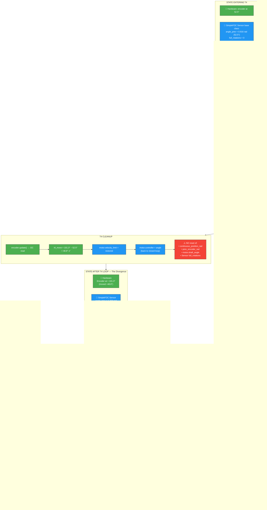

# T4 → T5 Signal Flow Diagram

**How to use**: Copy the mermaid code blocks below into [mermaid.live](https://mermaid.live/edit) to render as SVG/PNG for Miro.

---

## Diagram 1: T4 Open-Loop Test — Full Signal Flow



---

## Diagram 2: T5 Single update() Iteration — The Dual-Read Problem

```mermaid
flowchart TD
    classDef hw fill:#4CAF50,color:#fff,stroke:#333
    classDef sfoc fill:#2196F3,color:#fff,stroke:#333
    classDef custom fill:#FF9800,color:#fff,stroke:#333
    classDef problem fill:#F44336,color:#fff,stroke:#333
    classDef note fill:#FFF9C4,color:#333,stroke:#999
    classDef decision fill:#9C27B0,color:#fff,stroke:#333

    START(("mc.update()"))

    START --> FOC["motor.loopFOC()"]:::sfoc
    FOC --> FOC_1["→ sensor->update()"]:::sfoc
    FOC_1 --> FOC_2["→ getSensorAngle()<br/>⚡ I2C READ #1<br/>⚡ Filter update #1<br/>Returns value A"]:::hw
    FOC_2 --> FOC_3["Sensor base class:<br/>angle_prev = A<br/>Updates full_rotations"]:::sfoc
    FOC_3 --> FOC_4["SimpleFOC internal:<br/>shaft_angle = shaftAngle()<br/>= sensor_dir × getAngle() − offset<br/>Based on READ #1 value A"]:::sfoc

    FOC_4 --> READ2["encoder.getSensorAngle()<br/>⚡ I2C READ #2<br/>⚡ Filter update #2<br/>Returns value B ≠ A"]:::hw

    READ2 --> NOTE1["⚠️ B ≠ A because:<br/>1. Motor moved between reads<br/>2. Cartesian filter advanced twice<br/>3. Different hardware samples"]:::problem

    READ2 --> SYNC_CHECK{"SYNC CHECK<br/>|B − wrap(continuous_pos)| > 5°?"}:::decision

    SYNC_CHECK -->|"YES (48.8° first time,<br/>5-11° ongoing)"| SYNC_FIX["SYNC FIX:<br/>continuous_position_rad += offset<br/>prev_encoder_rad = B<br/>(snaps to READ #2 value)"]:::custom
    SYNC_CHECK -->|"NO (rarely)"| DELTA["Normal delta tracking"]:::custom

    SYNC_FIX --> DELTA
    DELTA --> DELTA_CALC["delta = B − prev_B<br/>continuous_position_rad += delta<br/>prev_encoder_rad = B"]:::custom

    DELTA_CALC --> OVERRIDE["motor.shaft_angle =<br/>continuous_position_rad<br/>(based on READ #2 / B values)"]:::custom

    OVERRIDE --> TARGET_CALC["Target calculation:<br/>current_wrapped = wrap(continuous_pos)<br/>error = target − current_wrapped<br/>normalized_target = continuous_pos + error<br/>(all based on READ #2 / B series)"]:::custom

    TARGET_CALC --> MOVE["motor.move(normalized_target)"]:::sfoc

    MOVE --> MOVE_INTERNAL["SimpleFOC move() internally:<br/>shaft_angle = shaftAngle()<br/>⬆️ OVERWRITES our line above!<br/>Now shaft_angle based on READ #1 / A"]:::problem

    MOVE_INTERNAL --> PID_ERROR["PID computes:<br/>error = target(B) − shaft_angle(A)<br/><br/>Target from READ #2 tracking<br/>Position from READ #1 tracking<br/>= BIASED ERROR SIGNAL"]:::problem

    PID_ERROR --> PID_OUT["Position PID (P=20, D=0):<br/>velocity_cmd = 20 × biased_error<br/>No damping to absorb bias"]:::sfoc

    PID_OUT --> VEL_PID["Velocity PID → Voltage → Motor"]:::sfoc
    VEL_PID --> MOTOR_MOVES["Motor moves (overshoots<br/>due to biased error + no damping)"]:::hw

    MOTOR_MOVES --> NEXT(("Next iteration:<br/>Oscillation continues")):::problem
```



---

## Diagram 3: State Mismatch Timeline

```mermaid
flowchart LR
    classDef hw fill:#4CAF50,color:#fff,stroke:#333
    classDef sfoc fill:#2196F3,color:#fff,stroke:#333
    classDef custom fill:#FF9800,color:#fff,stroke:#333
    classDef problem fill:#F44336,color:#fff,stroke:#333
    classDef ok fill:#8BC34A,color:#fff,stroke:#333

    subgraph T3_END["After T3"]
        T3H["🔧 Encoder: 52.5°"]:::hw
        T3S["🔵 SimpleFOC: 55.6°"]:::sfoc
        T3C["🟠 Custom: 52.5°"]:::custom
        T3V["Verdict: ~3° error<br/>(from calibration)"]:::ok
    end

    subgraph T4_END["After T4"]
        T4H["🔧 Encoder: 101.3°"]:::hw
        T4S["🔵 SimpleFOC Sensor:<br/>tracks 101.3° ✅<br/>shaft_angle: ~85.6°<br/>(open-loop integrator) ⚠️"]:::sfoc
        T4C["🟠 Custom: 52.5°<br/>48.8° STALE ❌"]:::problem
        T4V["Verdict: 48.8° mismatch<br/>between custom & encoder"]:::problem
    end

    subgraph T5_ITER1["T5 First update()"]
        T5H["🔧 Encoder: ~101°"]:::hw
        T5S["🔵 SimpleFOC shaft_angle:<br/>from shaftAngle() ≈ 101°"]:::sfoc
        T5C["🟠 Custom: SYNC fires!<br/>52.5° → 101° (fixed)<br/>But target was computed<br/>from READ #2 ≠ READ #1"]:::custom
        T5V["Verdict: SYNC fixes custom<br/>but bias between A & B<br/>series persists"]:::problem
    end

    subgraph T5_ONGOING["T5 Ongoing"]
        T5OH["🔧 Encoder: oscillating<br/>±5-11° around target"]:::hw
        T5OS["🔵 SimpleFOC: tracks A series"]:::sfoc
        T5OC["🟠 Custom: tracks B series<br/>Systematic offset from A<br/>SYNC fires every 1-2 iters"]:::problem
        T5OV["Verdict: Dual tracking<br/>= biased PID<br/>= sustained oscillation"]:::problem
    end

    T3_END --> T4_END --> T5_ITER1 --> T5_ONGOING
```



---

## Key

| Color | Meaning |
|-------|---------|
| 🟢 Green | Hardware / encoder reads (ground truth) |
| 🔵 Blue | SimpleFOC internal state |
| 🟠 Orange | Custom tracking layer (`continuous_position_rad`) |
| 🔴 Red | Problems / divergence points |
| 🟣 Purple | Decision points |

## Root Cause Summary

The T5 oscillation is caused by **two parallel tracking systems** reading the same encoder at different moments:

```
                    ┌─── I2C READ #1 ──→ SimpleFOC Sensor base ──→ shaft_angle (via shaftAngle())
                    │                     angle_prev, full_rotations     used by PID as CURRENT POS
MT6701 Encoder ─────┤
                    │
                    └─── I2C READ #2 ──→ Custom tracking layer ──→ normalized_target_rad
                                          continuous_position_rad       used by PID as TARGET
```

The PID error = `target(from B) − position(from A)` is systematically biased.
Combined with P=20 and D=0, this drives sustained oscillation.
