# T4 → T5 Signal Flow Diagram

**How to use**: Copy the mermaid code blocks below into [mermaid.live](https://mermaid.live/edit) to render as SVG/PNG for Miro.

---

## Diagram 1: T4 Open-Loop Test — Full Signal Flow

```mermaid
flowchart TD
    classDef hw fill:#4CAF50,color:#fff,stroke:#333
    classDef sfoc fill:#2196F3,color:#fff,stroke:#333
    classDef custom fill:#FF9800,color:#fff,stroke:#333
    classDef problem fill:#F44336,color:#fff,stroke:#333
    classDef neutral fill:#607D8B,color:#fff,stroke:#333
    classDef note fill:#FFF9C4,color:#333,stroke:#999

    subgraph T4_SETUP["T4 SETUP — Snapshot before loop"]
        A1["encoder.update()<br/>I2C read → Cartesian filter<br/>Sensor base class: angle_prev updated"]:::hw
        A1 --> A2["start_enc = encoder.getDegrees()<br/>= 52.5°"]:::hw

        A3["motor.velocity_limit = 2.0 rad/s<br/>(saved old limit)"]:::sfoc
        A4["motor.controller = angle_openloop"]:::sfoc
        A2 --> A3 --> A4

        A4 --> A5["ol_target = motor.shaft_angle + 30°<br/>shaft_angle ≈ 55.6° (from FOC)<br/>ol_target ≈ 85.6° (1.49 rad)"]:::sfoc
    end

    subgraph T4_STATE_PRE["STATE ENTERING T4"]
        S1["🔧 Hardware: encoder at 52.5°"]:::hw
        S2["🔵 SimpleFOC Sensor base class:<br/>angle_prev ≈ 0.916 rad (52.5°)<br/>full_rotations = 0"]:::sfoc
        S3["🟠 continuous_position_rad ≈ 0.916<br/>(set by mc.enable() in T3)"]:::custom
        S4["🟠 prev_encoder_rad ≈ 0.916"]:::custom
    end

    T4_STATE_PRE --> T4_SETUP

    A5 --> LOOP_START

    subgraph T4_LOOP["T4 LOOP — ×20 iterations, 100ms each"]
        LOOP_START(("i = 0..19"))

        LOOP_START --> L1

        subgraph ITER["Each iteration"]
            L1["motor.loopFOC()"]:::sfoc
            L1 --> L1a["→ sensor->update()"]:::sfoc
            L1a --> L1b["→ getSensorAngle()<br/>⚡ I2C READ from MT6701<br/>⚡ Cartesian filter update"]:::hw
            L1b --> L1c["→ Sensor base: angle_prev = filtered_val<br/>→ full_rotations ± if wraparound<br/>→ shaft_angle = shaftAngle()"]:::sfoc
            L1c --> L1d["In open-loop: loopFOC() returns<br/>early after sensor update<br/>(no FOC voltage calc)"]:::note

            L1d --> L2["motor.move(ol_target = 1.49 rad)"]:::sfoc
            L2 --> L2a["Open-loop mode internally:<br/>1. vel = clamp(target − shaft_angle, ±2.0)<br/>2. shaft_angle += vel × dt<br/>3. elec_angle = shaft_angle × pole_pairs<br/>4. setPhaseVoltage(V, 0, elec_angle)"]:::sfoc
            L2a --> L2b["⚡ Motor physically rotates<br/>~2.4° per iteration"]:::hw

            L2b --> L3["delay(100ms)"]:::neutral
        end
    end

    subgraph T4_STATE_POST["STATE AFTER T4 LOOP — The Divergence"]
        direction LR
        P1["🔧 Hardware<br/>Encoder at ≈ 101.3°<br/>(moved +48.8°)"]:::hw
        P2["🔵 SimpleFOC Sensor<br/>angle_prev ≈ 1.768 rad<br/>full_rotations = 0<br/>Tracks real position ✅"]:::sfoc
        P3["🟠 Custom Tracking<br/>continuous_position_rad<br/>≈ 0.916 rad (52.5°)<br/>NOT UPDATED ❌<br/>48.8° STALE"]:::problem
        P4["🔵 SimpleFOC shaft_angle<br/>Set by open-loop integrator<br/>≈ 1.49 rad (target angle)<br/>NOT matched to encoder ⚠️"]:::problem
    end

    T4_LOOP --> T4_CLEANUP

    subgraph T4_CLEANUP["T4 CLEANUP"]
        C1["encoder.update() → I2C read"]:::hw
        C1 --> C2["t4_move = 101.3° − 52.5° = 48.8° ✅"]:::hw
        C2 --> C3["motor.velocity_limit = restored"]:::sfoc
        C3 --> C4["motor.controller = angle<br/>(back to closed-loop)"]:::sfoc
        C4 --> C5["⚠️ NO reset of:<br/>• continuous_position_rad<br/>• prev_encoder_rad<br/>• motor.shaft_angle<br/>• Sensor full_rotations"]:::problem
    end

    T4_CLEANUP --> T4_STATE_POST
    T4_STATE_POST --> T5_START

    subgraph T5_START["T5 BEGINS — Inherits T4's State Mismatch"]
        T5A["encoder.update() → 101.3°"]:::hw
        T5A --> T5B["target = 101.3° + 30° = 131.3°"]:::neutral
        T5B --> T5C["mc.moveToPosition(131.3°)"]:::neutral
    end
```



---

## Diagram 2: T5 Single update() Iteration — The Dual-Read Problem

```mermaid
flowchart TD
    classDef hw fill:#4CAF50,color:#fff,stroke:#333
    classDef sfoc fill:#2196F3,color:#fff,stroke:#333
    classDef custom fill:#FF9800,color:#fff,stroke:#333
    classDef problem fill:#F44336,color:#fff,stroke:#333
    classDef note fill:#FFF9C4,color:#333,stroke:#999
    classDef decision fill:#9C27B0,color:#fff,stroke:#333

    START(("mc.update()"))

    START --> FOC["motor.loopFOC()"]:::sfoc
    FOC --> FOC_1["→ sensor->update()"]:::sfoc
    FOC_1 --> FOC_2["→ getSensorAngle()<br/>⚡ I2C READ #1<br/>⚡ Filter update #1<br/>Returns value A"]:::hw
    FOC_2 --> FOC_3["Sensor base class:<br/>angle_prev = A<br/>Updates full_rotations"]:::sfoc
    FOC_3 --> FOC_4["SimpleFOC internal:<br/>shaft_angle = shaftAngle()<br/>= sensor_dir × getAngle() − offset<br/>Based on READ #1 value A"]:::sfoc

    FOC_4 --> READ2["encoder.getSensorAngle()<br/>⚡ I2C READ #2<br/>⚡ Filter update #2<br/>Returns value B ≠ A"]:::hw

    READ2 --> NOTE1["⚠️ B ≠ A because:<br/>1. Motor moved between reads<br/>2. Cartesian filter advanced twice<br/>3. Different hardware samples"]:::problem

    READ2 --> SYNC_CHECK{"SYNC CHECK<br/>|B − wrap(continuous_pos)| > 5°?"}:::decision

    SYNC_CHECK -->|"YES (48.8° first time,<br/>5-11° ongoing)"| SYNC_FIX["SYNC FIX:<br/>continuous_position_rad += offset<br/>prev_encoder_rad = B<br/>(snaps to READ #2 value)"]:::custom
    SYNC_CHECK -->|"NO (rarely)"| DELTA["Normal delta tracking"]:::custom

    SYNC_FIX --> DELTA
    DELTA --> DELTA_CALC["delta = B − prev_B<br/>continuous_position_rad += delta<br/>prev_encoder_rad = B"]:::custom

    DELTA_CALC --> OVERRIDE["motor.shaft_angle =<br/>continuous_position_rad<br/>(based on READ #2 / B values)"]:::custom

    OVERRIDE --> TARGET_CALC["Target calculation:<br/>current_wrapped = wrap(continuous_pos)<br/>error = target − current_wrapped<br/>normalized_target = continuous_pos + error<br/>(all based on READ #2 / B series)"]:::custom

    TARGET_CALC --> MOVE["motor.move(normalized_target)"]:::sfoc

    MOVE --> MOVE_INTERNAL["SimpleFOC move() internally:<br/>shaft_angle = shaftAngle()<br/>⬆️ OVERWRITES our line above!<br/>Now shaft_angle based on READ #1 / A"]:::problem

    MOVE_INTERNAL --> PID_ERROR["PID computes:<br/>error = target(B) − shaft_angle(A)<br/><br/>Target from READ #2 tracking<br/>Position from READ #1 tracking<br/>= BIASED ERROR SIGNAL"]:::problem

    PID_ERROR --> PID_OUT["Position PID (P=20, D=0):<br/>velocity_cmd = 20 × biased_error<br/>No damping to absorb bias"]:::sfoc

    PID_OUT --> VEL_PID["Velocity PID → Voltage → Motor"]:::sfoc
    VEL_PID --> MOTOR_MOVES["Motor moves (overshoots<br/>due to biased error + no damping)"]:::hw

    MOTOR_MOVES --> NEXT(("Next iteration:<br/>Oscillation continues")):::problem
```



---

## Diagram 3: State Mismatch Timeline

```mermaid
flowchart LR
    classDef hw fill:#4CAF50,color:#fff,stroke:#333
    classDef sfoc fill:#2196F3,color:#fff,stroke:#333
    classDef custom fill:#FF9800,color:#fff,stroke:#333
    classDef problem fill:#F44336,color:#fff,stroke:#333
    classDef ok fill:#8BC34A,color:#fff,stroke:#333

    subgraph T3_END["After T3"]
        T3H["🔧 Encoder: 52.5°"]:::hw
        T3S["🔵 SimpleFOC: 55.6°"]:::sfoc
        T3C["🟠 Custom: 52.5°"]:::custom
        T3V["Verdict: ~3° error<br/>(from calibration)"]:::ok
    end

    subgraph T4_END["After T4"]
        T4H["🔧 Encoder: 101.3°"]:::hw
        T4S["🔵 SimpleFOC Sensor:<br/>tracks 101.3° ✅<br/>shaft_angle: ~85.6°<br/>(open-loop integrator) ⚠️"]:::sfoc
        T4C["🟠 Custom: 52.5°<br/>48.8° STALE ❌"]:::problem
        T4V["Verdict: 48.8° mismatch<br/>between custom & encoder"]:::problem
    end

    subgraph T5_ITER1["T5 First update()"]
        T5H["🔧 Encoder: ~101°"]:::hw
        T5S["🔵 SimpleFOC shaft_angle:<br/>from shaftAngle() ≈ 101°"]:::sfoc
        T5C["🟠 Custom: SYNC fires!<br/>52.5° → 101° (fixed)<br/>But target was computed<br/>from READ #2 ≠ READ #1"]:::custom
        T5V["Verdict: SYNC fixes custom<br/>but bias between A & B<br/>series persists"]:::problem
    end

    subgraph T5_ONGOING["T5 Ongoing"]
        T5OH["🔧 Encoder: oscillating<br/>±5-11° around target"]:::hw
        T5OS["🔵 SimpleFOC: tracks A series"]:::sfoc
        T5OC["🟠 Custom: tracks B series<br/>Systematic offset from A<br/>SYNC fires every 1-2 iters"]:::problem
        T5OV["Verdict: Dual tracking<br/>= biased PID<br/>= sustained oscillation"]:::problem
    end

    T3_END --> T4_END --> T5_ITER1 --> T5_ONGOING
```



---

## Key

| Color | Meaning |
|-------|---------|
| 🟢 Green | Hardware / encoder reads (ground truth) |
| 🔵 Blue | SimpleFOC internal state |
| 🟠 Orange | Custom tracking layer (`continuous_position_rad`) |
| 🔴 Red | Problems / divergence points |
| 🟣 Purple | Decision points |

## Root Cause Summary

The T5 oscillation is caused by **two parallel tracking systems** reading the same encoder at different moments:

```
                    ┌─── I2C READ #1 ──→ SimpleFOC Sensor base ──→ shaft_angle (via shaftAngle())
                    │                     angle_prev, full_rotations     used by PID as CURRENT POS
MT6701 Encoder ─────┤
                    │
                    └─── I2C READ #2 ──→ Custom tracking layer ──→ normalized_target_rad
                                          continuous_position_rad       used by PID as TARGET
```

The PID error = `target(from B) − position(from A)` is systematically biased.
Combined with P=20 and D=0, this drives sustained oscillation.
